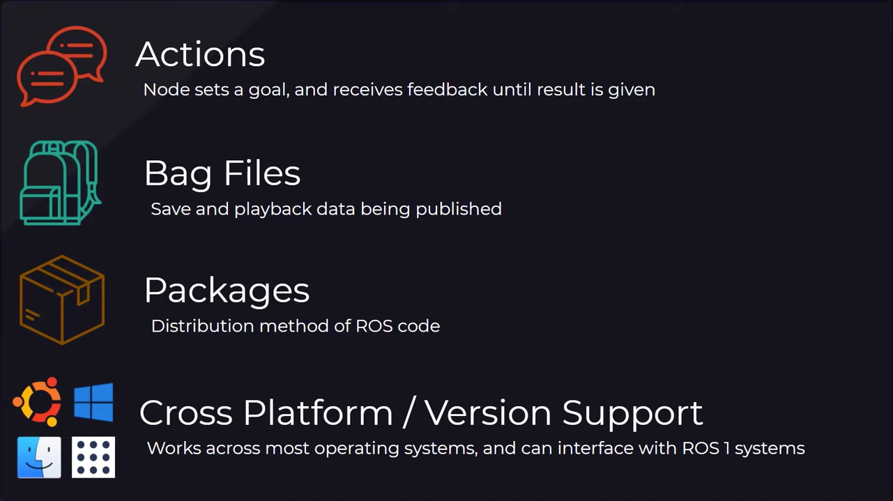

# Tools

## OpenCV
Library for implementing computer vision supporting python, c++, java, ...  
[Documentation](https://docs.opencv.org/4.x/)

### Installation
- [https://opencv.org/get-started/](https://opencv.org/get-started/)

## PX4
Tool for programming Pixhawk drones  
- Integrated with Gazebo simulator  
- [Comparison with ArduPilot](https://dojofordrones.com/ardupilot-vs-px4/)

PX4 was chosen because of good support on MacOS and integrated gazebo simulator

### Installation
- [Video guide for MacOS](https://www.youtube.com/watch?v=h0q8Og9vBWQ)
- [Instalation and run using Gazebo simulator](https://docs.px4.io/main/en/dev_setup/building_px4.html#gazebo)
- [Integration with ROS2](https://docs.px4.io/main/en/ros2/user_guide.html#installation-setup)

### Run 
```sh
# drone_ws/src
source drone_venv/bin/activate
cd PX4-Autopilot
make px4_sitl gz_x500 # starts gazebo simulator as well
```
In case of problems with startup, make sure QGroundControl station is running

## Gazebo Harmonic
Physics simulator supporting drone simulation with PX4  
[Documentation](https://gazebosim.org/docs/harmonic/getstarted/)  
[Installation on mac via Homebrew](https://gazebosim.org/docs/harmonic/install_osx/)
```
brew tap osrf/simulation
brew install gz-harmonic
```

## ROS 2 Humble
Collection of libraries and tools for programming robot systems (including drones)  
[What is ROS?](https://www.youtube.com/watch?v=7TVWlADXwRw)



[Documentation](https://docs.ros.org/en/humble/Installation.html)  
[Mac installation using conda](https://robostack.github.io/GettingStarted.html#__tabbed_1_1)

### Run
```sh
conda activate
conda activate ros_env
rviz2 # starting the simulator as an example
```

## QGroundControl
Mission planner and monitoring tool  
[Installation](https://docs.qgroundcontrol.com/master/en/qgc-user-guide/getting_started/download_and_install.html)

## MAVSDK
[Installation](https://mavsdk.mavlink.io/main/en/python/quickstart.html)

## Running environment
