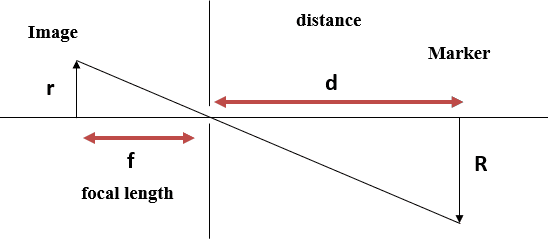

# Camera

## Camera calibration
[Camera calibration overview](https://www.analyticsvidhya.com/blog/2021/10/a-comprehensive-guide-for-camera-calibration-in-computer-vision/)

## Distance determination
[Computing distance from image](https://www.baeldung.com/cs/cv-compute-distance-from-object-video)
