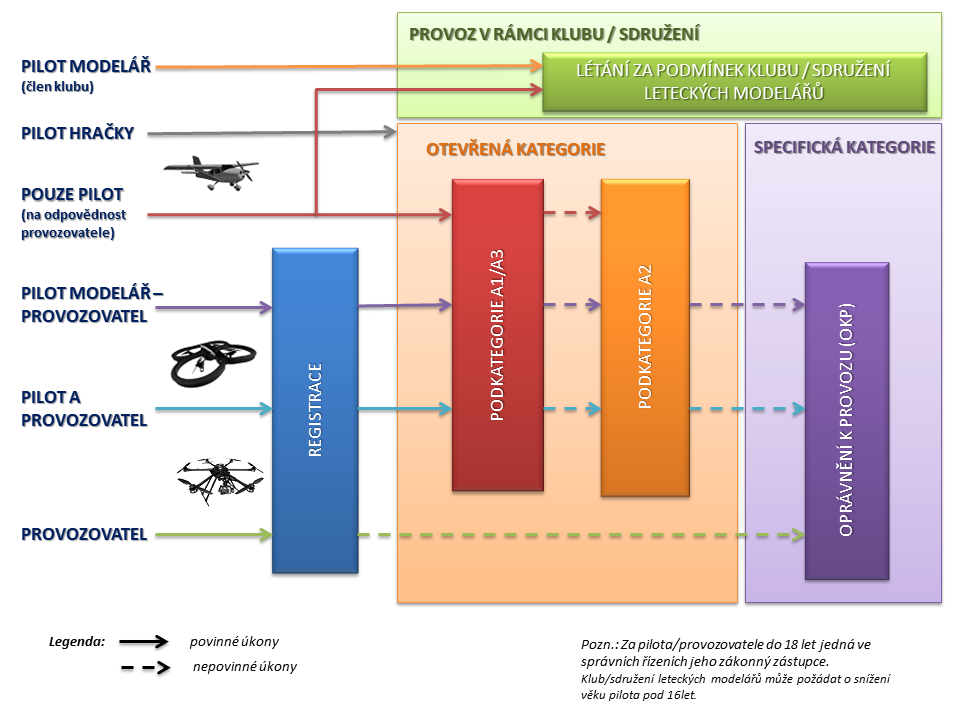
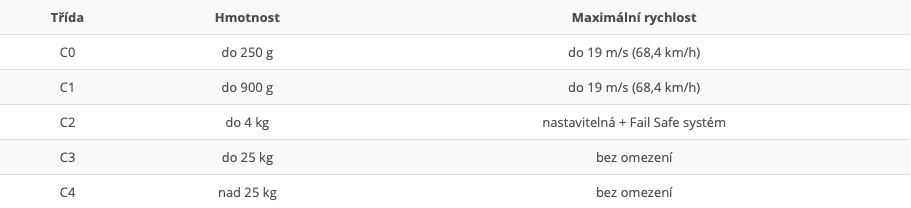
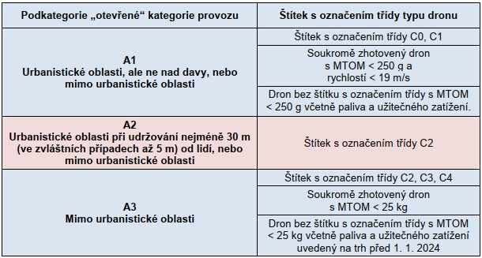

# Laws regarding drone operation

This is an overview of the current laws and procedures required when operating a drone.

As of time of writing, the rules of drone operation have been set by the EU. In Czech Republic, they are managed by Úřad pro civilní letectví (UAC), and an overview of the rules is available at their [website](https://www.caa.cz/provoz/bezpilotni-letadla/), and also on the [official government website](https://portal.gov.cz/rozcestniky/letani-s-dronem-RZC-101)  

|  |
| :: |
| [*Schema of required prerequisites for drone operation from 31. 12. 2020*](https://www.caa.cz/provoz/bezpilotni-letadla/zakladni-informace-k-regulacnimu-ramci-eu-pro-bezpilotni-systemy/) |

## Open category
The "open" category of drone operation is divided into three subcategories (A1, A2, A3), each with its own specific requirements for pilot qualifications, operational limitations, and technical standards for drones.  

Key points include:

- Drones must not violate airspace restrictions. (see DroneView)
- Flight altitude is limited to a maximum of 120m above ground.
- The pilot must keep the drone within visual line of sight.
- Drones must have a maximum take-off weight under 25 kg.
- The drone must not carry hazardous goods or release materials mid-flight.

- Drones are classified by weight and speed and fall into into classes (C0 to C4).
- All drones must be registered, display operator numbers, and adhere to manufacturer guidelines.

|  |
| :: |
| [ *Drone classes - vzdusin.cz* ](https://www.vzdusin.cz/jak-registrovat-dron) |

### Subcategory A1: 
- Designed for light drones **under 500g** or those **below 250g sold before 2023**.
- It allows operation over people but **not over gatherings**.
- Registration and **online training *(certificate A1/A3)*** are required.

### Subcategory A2: 
- For flights **near people** with drones **weighing 500g–2kg**.
- Requires safe distance of (5-50m) from people and **low-speed modes in close proximity to people**.
- **A1/A3 certificate** is required as well as **A2 certificate** given by UCS

### Subcategory A3:
- For operations in **remote areas away from people**, with drones **weighing up to 25kg**.
- Pilots must ensure a 150m horizontal distance from populated zones and complete **online training *(certificate A1/A3)***.  

|  |
| :: |
| [*Categories overview*](https://www.caa.cz/provoz/bezpilotni-letadla/otevrena-kategorie-open/) |

Official rules available at the [UCL website](https://www.caa.cz/provoz/bezpilotni-letadla/otevrena-kategorie-open/provoz-v-ramci-otevrene-open-kategorie/)

## Specific category
Drones intended for professional use, typically requiring special permits. DIY drones fall into this category.

## Certified category
Currently a futuristic category, which will include drones designed for transporting people or cargo.

## Useful links

[Rules explained by category (by DJI Telink)](https://www.djitelink.cz/legislativa-pro-drony-2024-vysvetlena-podle-rizikovosti-provozu-p25098/)  

[Unofficial overview of the rules (by DRON PRO)](https://dronpro.cz/jak-se-orientovat-v-letecke-mape-a-predejit-tak-problemum-pri-letani-s-dronem?srsltid=AfmBOoqCd_qHqvbOWD_DCDLWRfiYudE9FlrHrIxwyPdvRYT8hX5vXtcA)  

[Drone registration (by vzdusin.cz)](https://www.vzdusin.cz/jak-registrovat-dron)  

[DroneView](https://dronview.rlp.cz)  
[AisView](https://aisview.rlp.cz)  

|  |
| :: |
| [*DroneView - online map with flight zones*](https://dronview.rlp.cz) |
