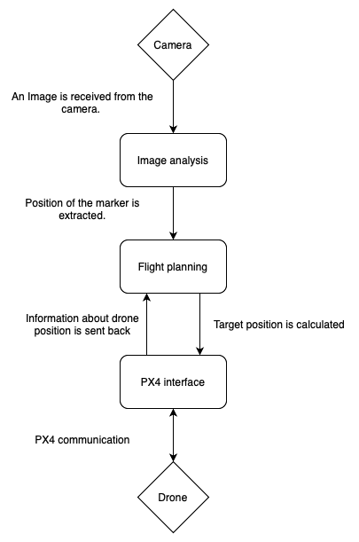

# Modules

Overview of suggested modules and their functionality.

**Camera processing module for image acquisition.**  
- This module will receive images captured by the camera and perform preprocessing, so that the image can be correctly analyzed. It will then send the prepared image to the *Marker detection* module.

**Marker detection module using OpenCV.**  
- This module will receive the prepared image and extract the position of a marker from the image. It will also handle situations, when the marker is not visible by informing the *Path planning* module.

**Path planning and navigation to handle marker approach and landing.**  
- This module will receive the position of the marker in the frame and calculate a target position for the drone. This target will be sent to the drone control interface. This module will also dynamically adjust the target, as of to increase precision.

**Drone control interface for PX4 commands.**  
- This module receives a goal for the drone to reach and will translate it into PX4 commands and send it to the drone. It will also send information about the drones' position and movement back to the Path planning module for adjusting further commands.

## Diagram
